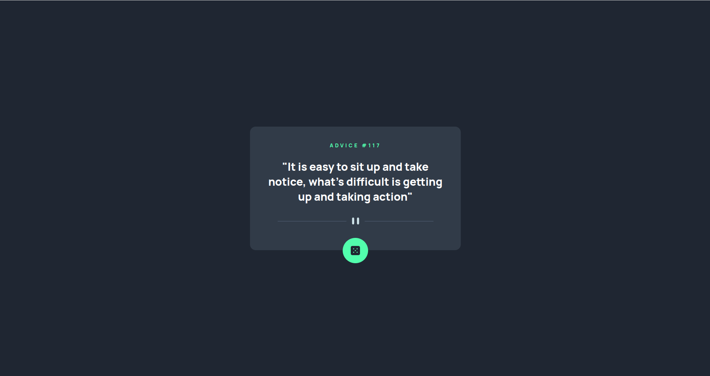
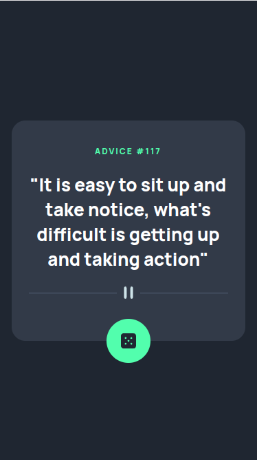

# Desafio Frontend Mentor - Intro component with sign up form solution

This is a solution to the [Intro component with sign up form challenge on Frontend Mentor](https://www.frontendmentor.io/challenges/advice-generator-app-QdUG-13db) Frontend Mentor challenges help you improve your coding skills by building realistic projects. 

## Welcome! 👋

Thanks for checking out my front-end coding challenge.

## Overview

### The challenge

Users should be able to:

- View the optimal layout for the site depending on their device's screen size
- See hover states for all interactive elements on the page
- Generate a new piece of advice by clicking the dice icon

### Screenshot
#### Desktop

#### Mobile

### Links

- Live Site URL: (https://vtrv123.github.io/challenge-advice-generator-app/)

## My process

### Built with

- Semantic HTML5 markup
- CSS custom properties
- Flexbox
- JavaScript

### What I learned

In this challenge, I practiced my HTML5, CSS3 and JavaScript skills. The main challenge for me was making use of the Advices Slip API with JavaScript, and displaying the fetched data on the DOM. 

The page's layout is fairly simple, and was built using Flexbox. Absolute positioning was used to place the dice button on the bottom of the container.

The JS script was also considerably short, consisting of element selection and manipulating data from the Advices Slip API using the 'fetch' command and an async/await function. Clicking the dice button generates a request to the API for a advice, the data received from the API is processed and displayed on the screen using DOM manipulation. 
